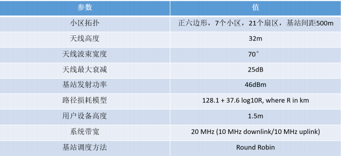
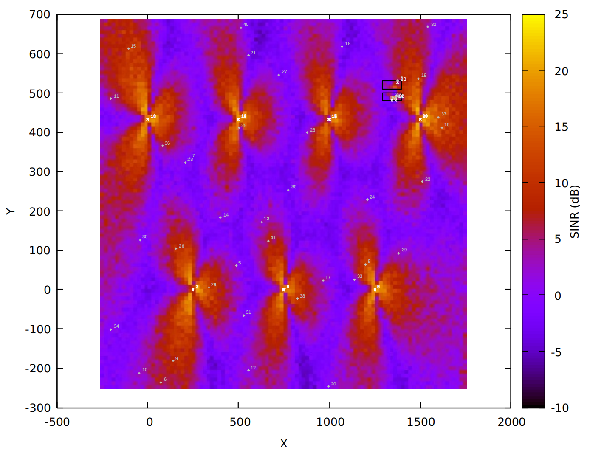
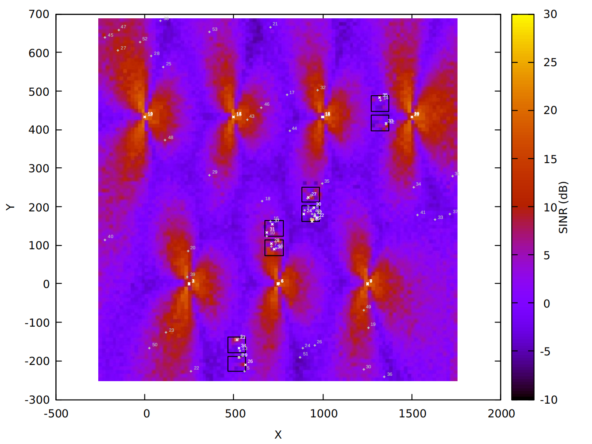

# 利用NS3部署一个LTE网络

[toc]


## 1.代码原型

代码原型来自`ns3/ns-allinone-3.30.1/ns-3.30.1/src/lte/examples/lena-dual-stripe.cc`

这段代码是用于配置和运行一个NS-3模拟的LTE网络，其结构和参数基于3GPP的双条纹模型。

这段代码一共有以下部分：

1. **全局参数配置**：
   - 设置了多个全局参数，如宏基站的数量、每个宏基站的带宽、小区内部署比率等。
   - 定义了宏用户设备(UEs)的位置范围、运动速度、仿真时间等。
2. **建筑物和小区块分配**：
   - 使用`FemtocellBlockAllocator`类来在特定区域内创建建筑物块，每个块包含一定数量的公寓和楼层。
3. **基站和用户设备(Node)的创建与配置**：
   - 创建了宏基站(`macroEnbs`)和家庭基站(`homeEnbs`)，以及宏用户(`macroUes`)和家庭用户(`homeUes`)。
   - 设置了宏基站和家庭基站的物理层和无线电通信配置，包括传输功率和频率。
4. **移动性模型**：
   - 为不同类型的用户设备配置了不同的移动性模型，包括固定位置和随机移动模型。
5. **LTE助手配置**：
   - 配置了LTE助手(`LteHelper`)，包括路径损耗模型、天线模型和频谱信道类型。
6. **EPC网络配置**：
   - 如果启用了EPC，将配置端到端的网络拓扑，包括远程主机和PGW的点对点连接，以及UE的IP堆栈。
7. **应用程序配置**：
   - 根据是否使用UDP或TCP，为UEs配置下行链路和上行链路数据流。
8. **信号质量映射(REM)**：
   - 如果启用REM，将生成并输出无线电环境地图，以显示网络中的信号质量。
9. **仿真执行**：
   - 开启了MAC和RLC层的跟踪，用于分析和调试。
   - 运行仿真，并在完成后销毁LTE助手和仿真实例。

代码使用NS-3的多个模块和助手类来创建一个综合的LTE网络模拟环境。它展示了如何通过NS-3设置和运行一个基于规定标准的网络模型，并且如何通过全局值和命令行参数来调整网络参数。


## 2.修改代码

在此实验中，需要我们根据以下参数要求修改代码原型中的参数：




具体修改方式在此链接中有详细说明：[利用NS3部署一个LTE网络_ns3 云端通信-CSDN博客](https://blog.csdn.net/Shmily1107/article/details/110919007)‘

**注：本代码没有修改系统带宽，貌似ns3的其他文件并不支持带宽为20，如果硬要修改的话得改很多文件，并且有的参数也无法确定。**


## 3.代码流程

1. **代码执行**:
   
   使用以下命令来执行代码：
   
   ```bash
   ./waf --run="scratch/ltee --generateRem=1 --nMacroEnbSites=7 --nMacroEnbSitesX=3 --ns3::RadioBearerStatsCalculator::DlRlcOutputFilename=a3-rsrp-DlRlcStats.txt --ns3::RadioBearerStatsCalculator::UlRlcOutputFilename=a3-rsrp-UlRlcStats.txt"
   ```
   
   运行 NS-3 脚本时，`--generateRem=1` 参数告诉模拟生成一个 REM。参数 `--nMacroEnbSites=7 --nMacroEnbSitesX=3` 设置了宏基站的数量和布局。7代表一共有7个宏基站，3代表使用一行有三个宏基站，但图示中会有四个宏基站在第二列，因为宏基站是正六边形的，为了满足网络全覆盖，所以采用蜂窝状布局。
   
2. **文件生成**:
   - `PrintGnuplottableBuildingListToFile` 函数将建筑物的位置写入 `buildings.txt`。
   - `PrintGnuplottableEnbListToFile` 函数将基站的位置和 Cell ID 写入 `enbs.txt`。
   - `PrintGnuplottableUeListToFile` 函数将用户设备（UEs）的位置和 IMSI 标签写入 `ues.txt`。
   - `RadioEnvironmentMapHelper` 类生成了 REM 数据，并将其保存到 `expr3.rem` 文件中。这个文件包含了网络中不同位置的信号强度信息。

3. **Gnuplot 绘图**:

   -  Gnuplot 脚本 `draw` 定义了如何绘制这些数据。它设置了图的视图类型、标签和颜色条（colorbar）的标签。
   - `plot "expr3.rem"` 命令使用 REM 数据创建了图像。`($1):($2):(10*log10($4))` 表示使用第一列和第二列作为 x, y 坐标，将第四列的数据（通常是功率或信噪比）转换为分贝（通过 `10*log10($4)`）并用作颜色的强度值。

4. **图像解释**:
   - 在生成的图像中，每个基站的位置由一个白点表示（`enbs.txt` 中的数据）。
   - 用户设备由灰点表示（`ues.txt` 中的数据）。
   - 建筑物的轮廓由矩形表示（`buildings.txt` 中的数据）。
   - 背景的颜色表示不同位置的信噪比，其中颜色的强度与信噪比的值对应。颜色条（colorbar）显示了颜色与 SINR 值的映射。通常，黄色或橙色区域表示信噪比较高，而紫色或蓝色区域表示信噪比较低。

在模拟中，REM 图表明了哪些区域有较好的信号接收质量（例如，接近基站的地方），以及信号质量较差的区域（例如，远离基站或可能受到建筑物阻挡的地方）。这样的 REM 可用于评估网络覆盖和规划无线网络。


## 4.建筑生成

建筑是以建筑块为单位生成的，一个建筑块里有两个建筑物

**在 `FemtocellBlockAllocator` 构造函数中**:

```c
m_xSize (nApartmentsX*10 + 20),
m_ySize (70)

```

这里，`m_xSize` 和 `m_ySize` 确定了每个建筑块的尺寸。`nApartmentsX` 控制了沿 X 轴的公寓（或房间）数量，而乘数和加数则定义了单个公寓的尺寸和建筑物之间的间隔。

**在 `Create()` 方法中**:

```c
gridBuildingAllocator->SetAttribute ("LengthX", DoubleValue (10*m_nApartmentsX));
gridBuildingAllocator->SetAttribute ("LengthY", DoubleValue (10*2));
gridBuildingAllocator->SetAttribute ("DeltaX", DoubleValue (10));
gridBuildingAllocator->SetAttribute ("DeltaY", DoubleValue (10));
gridBuildingAllocator->SetAttribute ("Height", DoubleValue (3*m_nFloors));

```

这些属性定义了 `GridBuildingAllocator` 用于创建建筑物的具体参数。`LengthX` 和 `LengthY` 是每个建筑物的长度和宽度，`DeltaX` 和 `DeltaY` 是建筑物间的间距，`Height` 是建筑物的高度，这里假设每层楼高为 3 米。


我们可以更改建筑物的参数，来看不同的建筑物对信号的影响：

更改建筑物尺寸（例如，想要更宽的建筑物）:

```c
m_xSize (nApartmentsX*15 + 30), // 更宽的建筑物
m_ySize (100) // 更长的建筑物

```

在 `Create()` 方法中设置不同的属性值:

```c
gridBuildingAllocator->SetAttribute ("LengthX", DoubleValue (15*m_nApartmentsX)); // 假设每个公寓宽度为 15 米
gridBuildingAllocator->SetAttribute ("LengthY", DoubleValue (15*2)); // 假设建筑物深度为 30 米
gridBuildingAllocator->SetAttribute ("Height", DoubleValue (4*m_nFloors)); // 假设每层楼高为 4 米

```

至于每个建筑块的位置的话，位置是随机生成的，是原本代码写好的逻辑，他的逻辑可以保证生成的位置一定在图中，这个逻辑我就不改了。


## 5.rem文件

在 `expr3.rem` 文件中，每列数据代表以下内容：

1. **第一列** (`$1`): `X` 坐标 - 这是地图上每个点的水平位置。
2. **第二列** (`$2`): `Y` 坐标 - 这是地图上每个点的垂直位置。
3. **第三列** (`$3`): `Z` 坐标 - 这通常是接收点的高度，这里它被设定为 1.5 米，这可能是用户设备的平均高度。
4. **第四列** (`$4`): 值 - 在这种情况下，它代表的是在对应的 `X`, `Y`, `Z` 坐标下测量的信号强度，或者更具体的是，信号与噪声比（SINR）的原始值。

在 Gnuplot 脚本中，这些值被用来创建图像，其中 `X` 和 `Y` 值决定了图上点的位置，而第四列的值（经过 `10*log10($4)` 转换）决定了点的颜色强度，这表现为图像上不同颜色的强度，用来表示信号的质量。信号越强，点的颜色就越靠近色条（colorbar）的黄色或橙色端；信号越弱，点的颜色就越靠近紫色或蓝色端。在我的图中，信号值从大约 1.0 到 2.9 不等，表示信号质量在不同位置有所变化。


## 6.一共有多少个基站，多少个用户设备，分别是在代码哪里被创建的

代码中基站和用户设备的数量由一系列全局变量定义，它们通过 `GlobalValue` 在 `main` 函数中进行配置。基站分为宏基站（macro eNBs）和家庭基站（home eNBs），用户设备也分为宏用户（macro UEs）和家庭用户（home UEs）。

基站和用户设备的数量及其创建位置如下：

1. **宏基站数量**:
   - `uint32_t nMacroEnbs = 3 * nMacroEnbSites;`
   - 宏基站的数量由全局变量 `g_nMacroEnbSites` 定义，代码中设定为 3 个宏基站网站，每个小区有 3 个宏基站（每个扇区一个），因此总共有 `3 * nMacroEnbSites` 个宏基站。
2. **家庭基站数量**:
   - `uint32_t nHomeEnbs = round (4 * nApartmentsX * nBlocks * nFloors * homeEnbDeploymentRatio * homeEnbActivationRatio);`
   - 家庭基站的数量是根据公寓数、楼层数、部署比例和激活比例计算出来的。
3. **宏用户设备数量**:
   - `uint32_t nMacroUes = round (macroUeAreaSize * macroUeDensity);`
   - 宏用户设备的数量是根据用户密度和宏用户活动区域的大小计算出来的。
4. **家庭用户设备数量**:
   - `uint32_t nHomeUes = round (nHomeEnbs * homeUesHomeEnbRatio);`
   - 家庭用户设备的数量是根据家庭基站数量和每个家庭基站对应的平均用户数量计算出来的。

创建这些节点的代码如下：

```c
NodeContainer homeEnbs;
homeEnbs.Create (nHomeEnbs);
NodeContainer macroEnbs;
macroEnbs.Create (3 * nMacroEnbSites);
NodeContainer homeUes;
homeUes.Create (nHomeUes);
NodeContainer macroUes;
macroUes.Create (nMacroUes);
```

每个 `Create` 方法调用都会生成一个 `NodeContainer`，这是 NS-3 中用于持有一组网络节点的容器。例如，`homeEnbs.Create(nHomeEnbs);` 创建了一组家庭基站节点，数量等于 `nHomeEnbs`。

为了得到宏基站和用户设备的实际数量，需要查看 `nMacroEnbSites`、`nMacroEnbSitesX`、`nHomeEnbDeploymentRatio`、`nHomeEnbActivationRatio`、`homeUesHomeEnbRatio`、`macroUeDensity` 以及 `nBlocks`、`nApartmentsX`、`nFloors` 这些全局变量的值。这些值可以通过命令行参数来改变，因此，如果在运行 NS-3 模拟时提供了不同的参数，这些实际值可能会有所不同。


## 7.每个点的信号强度是由哪些因素决定

这个信号强度就与我们本实验设置的参数有关：


**传播损耗 (Path Loss)**: 随着距离的增加，信号强度呈指数级减弱。传播损耗模型考虑了信号在空间传播过程中的衰减，这是信号强度减弱的主要原因。

**阴影效应 (Shadowing)**: 建筑物、地形或其他障碍物对信号的遮挡会造成信号强度的额外变化，这称为阴影效应。阴影效应通常使用具有一定方差的对数正态分布来建模。

**多径效应 (Multipath Fading)**: 信号在达到接收器时会经过多个路径，这些不同路径上的信号可能会相互加强或抵消。多径效应可以增强也可以削弱信号强度。**因为我们设置了衰落模型（倒数第三个参数），所以多径衰落也会影响信号强度**

**小区配置 (Cell Configuration)**: 包括基站的发射功率、天线增益、天线方向性（如波束宽度）以及使用的频率带宽。

**干扰 (Interference)**: 来自其他小区的信号可能会对当前信号造成干扰，特别是在频率复用的情况下。

**天线模型 (Antenna Pattern)**: 基站和用户设备的天线辐射模式，影响着信号的传播方向和强度。


## 8.代码执行

1. 在`ns3/ns-allinone-3.30.1/ns-3.30.1`目录下执行`expr3.sh`，生成文件`buildings.txt` `enbs.txt`  `ues.txt` `expr3.rem`

2. 然后在此目录下执行命令：

   ```bash
   gnuplot -p enbs.txt ues.txt buildings.txt draw
   ```

   生成结果图


## 9.结果

结果1，只生成一个建筑块：




结果2，生成两个建筑块：


结果3，生成三个建筑块，并且修改大小：



可以看到基站的信号会受到建筑的影响。


